<table style="width:100%">
  <tr>
    <th>License</th>
    <th>Gitlab CI</th>
    <th>Code Coverage</th>
    <th>Coverage with codecov.io</th>
  </tr>
  <tr>
    <td>
        
    </td>
    <td>
        
    </td>
    <td>
        
    </td>
    <td>
        
    </td>
  </tr>
</table>

<table style="width:100%">
  <tr>
    <th>Platform</th>
    <th>Tests</th>
    <th>Firebase App Distribtion</th>
  </tr>
  <tr>
    <td>
        
    </td>
    <td>
        
    </td>
    <td>
        
    </td>
  </tr>
</table>

 
# flutter_breaking_news

Another Flutter Open Source project: an in-depth overview for your **CI/CD** pipeline with Flutter.

The application will display breaking news using the [News API](https://newsapi.org/)

## App Screenshot

Here are some screenshots of the running application:

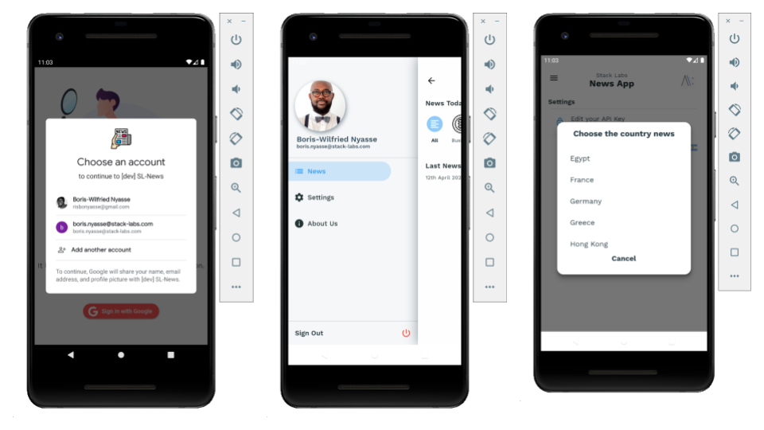

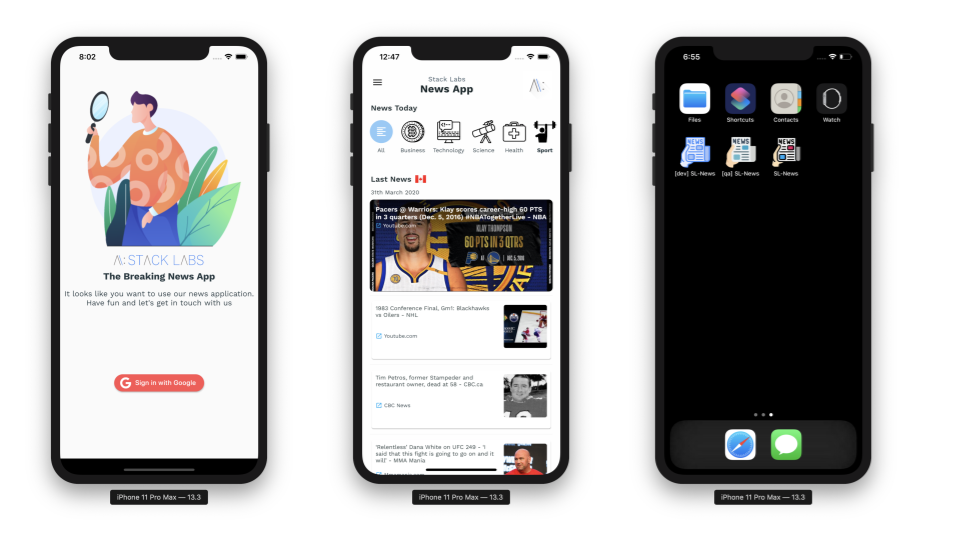

## Technologies

### 1. **Flutter Flavors**:

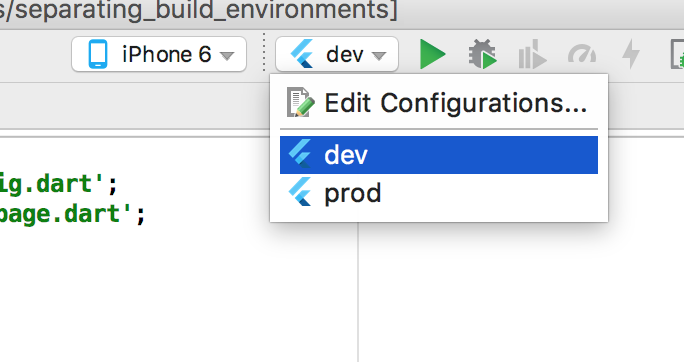

It is a good practice to build separate apps for different environments ( dev, prod, ...).
In case of mobile apps, the best way to have these separate configurations is by using **flavors**.

The concept of flavors is taken from Android apps and can be applied to iOS using **schemes**.

Thanks to [Dominik Roszkowski](https://github.com/orestesgaolin) for the wonderful guide that helped me
setup Flavors in Flutter:

- [Flavors in Flutter with Fastlane ](https://roszkowski.dev/2019/flutter-flavors/)

In the code, I've implemented 3 flavors: **dev**, **qa**, **prod**.

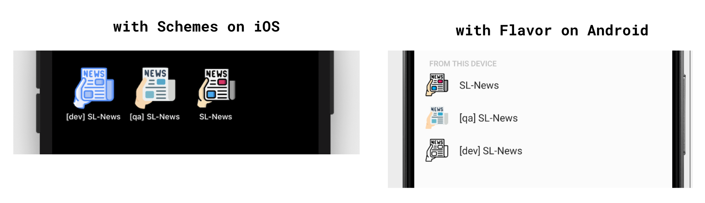

 

### 2. **Fastlane**:

[Fastlane](https://fastlane.tools/) is an open source platform aimed at simplifying Android and iOS deployment.
Fastlane lets you automate every aspect of your development and release workflow.

My goal is to use Fastlane to automate app deployment to my QA environment.

I've setup [fastlane match](https://docs.fastlane.tools/actions/match/), the **new approach to iOS code signing: Share
one code signing identity across your development team to simplify your codesigning setup and prevent code signing issues.**

**match** creates all required certificates & provisioning profiles and stores them
in a separate private git repository.

See my `faslane/` folder for more.

 

### 3. **Firebase App Distribution**:

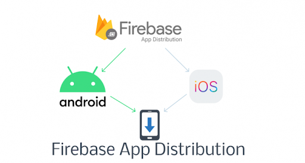

[Firebase App Distribution](https://firebase.google.com/docs/app-distribution) is my QA environment.
I am using the [fastlane plugin for Firebase App Distribution](https://github.com/fastlane/fastlane-plugin-firebase_app_distribution)
to distribute apps to trusted testers.

Below is a sample fastlane code used in the project to deploy the android version of the app to Firebase App Distribution.

        firebase_app_distribution(
            app: ENV["FIREBASE_ANDROID_TEST_APP_ID"],
            firebase_cli_token: ENV["FIREBASE_CLI_TOKEN"],
            apk_path: "build/app/outputs/apk/qa/release/app-qa-release.apk",
            release_notes_file: "distribution/release-notes.txt",
            testers_file:  "distribution/testers.txt"
        )

See my `faslane/` and `distribution/` folders for more.

#### Invitation Email:

When my pipeline build is succesful, the testers receive an invitation email as the following:

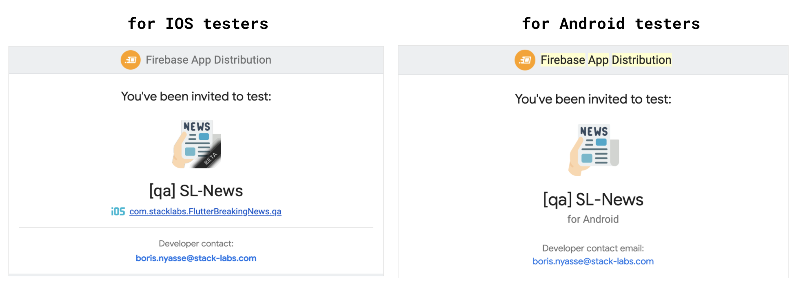

#### Invitation apps:

According to my environment, I can see all the versions of my application available for testing in my QA environment.

 

### 4. **Codemagic**:

[Codemagic](https://codemagic.io/) offers me the possibility to implement **CI/CD**. It starts with my git repository hosted on **Gitlab**.

I am using [codemagic environment variables](https://docs.codemagic.io/building/environment-variables/) for my build.
I prefer to use a [codemagic.yaml](https://docs.codemagic.io/building/yaml/) file for customizing the build
and configuring all my workflows ( _You will find a `.codemagic.yaml` in the root of the project._ )

By doing this, all my secret keys for connecting to Apple, Firebase and so on are encrypted.

For example, the **post-clone** step allows me to generate all the keys I need to build the project.

The following is a sample way to generate key in a post-clone codemagic step:

    echo "--- Generate Google Service key for Android"
    GOOGLE_SERVICES_JSON_PATH="$FCI_BUILD_DIR/android/app/google-services.json"
    echo $GOOGLE_SERVICES_JSON_BASE64 | base64 --decode > $GOOGLE_SERVICES_JSON_PATH

See my `codemagic/` folder for more.

I would recommand you to try codemagic for your future CI/CD with Flutter. The following is an example of a pipeline state in Codemagic.

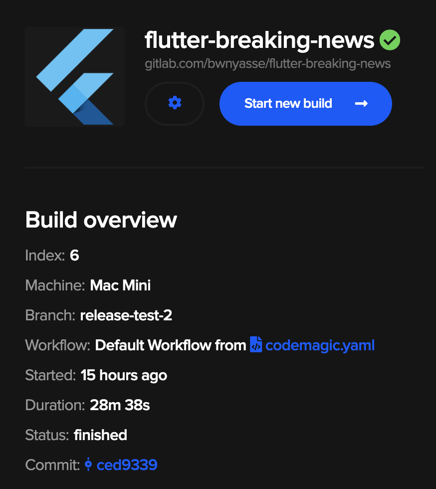

### 5. **Codecov**:

Well, it is nice to test your flutter code, but it is better to have to setup the code coverage.

I am testing the application with the following command:

        $> flutter test --coverage

And I am using [codecov](https://codecov.io/) for my coverage reports.

In the root folder of the project, I have a `.codecov.yml` for the coverage configuration.

### 6. **Gitlab CI**:

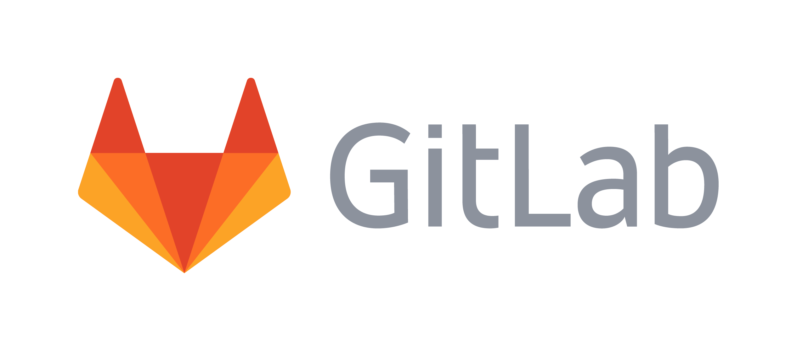

In the root folder of the project, I have a `.gitlab-ci.yml`. Gitlab uses this file for CI/CD.
Once I commit a code and push it to Gitlab, it should run a job.

I am using Gitlab to build application for every push made on every branch except for a branch named **release**.

My gitlab pipeline does the following:

- test my flutter application
- build the code coverage
- deploy the coverage result

So the continuous deployement ( CD ) part is made with Codemagic as mentioned before.

## Code & Design Patterns

### 1. **BLOC**:

BLoC a.k.a **Business Logic Components** is a design pattern presented by Paolo Soares and Cong Hui, from Google at the DartConf 2018.

So I used Bloc, for the **state management** of the application. This design pattern helps to separate presentation from business logic.

I am using the well known [bloc library](https://github.com/felangel/bloc) for Dart & Flutter in this project.

### 2. JSON using code generation libraries

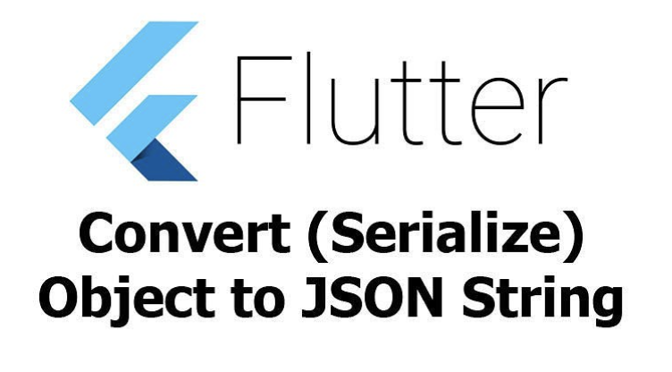

I am big fan of code generation when it comes to consuming API data. According to the official documentation about [JSON and Serialization](https://flutter.dev/docs/development/data-and-backend/json).

I am using **json_annotation** + **json_serializable** to retrieve news from [News API](https://newsapi.org/).

### 3. Authentication

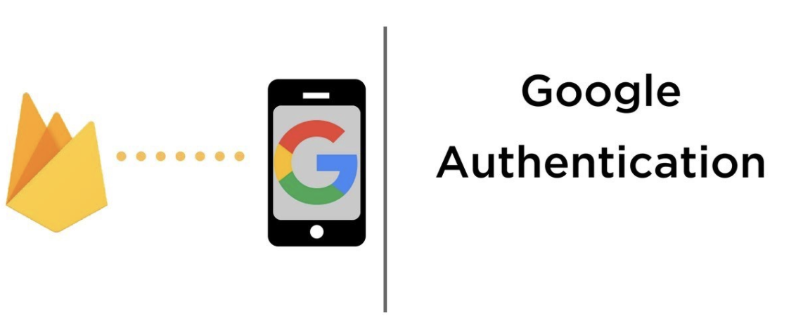

The auth process is handled in a serveless way with a Google Cloud project named **[Firebase](https://firebase.google.com/)**.
To sign in the application, you must sign in with a **google account**.

## How to use

### 1. Get News API Key

You must create an account with the [News API](https://newsapi.org/) to retrieve an API Key.

You will need to provide this API Key in the application, in the followng settings screen:

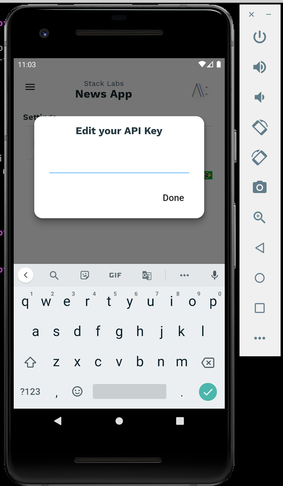

### 2. Setup Firebase

As mentionned in the [Firebase doc](https://firebase.google.com/support/guides/google-android#migrate_your_console_project):

> Firebase manages all of your API settings and credentials through a single configuration file.
> The file is named google-services.json on Android and GoogleService-Info.plist on iOS.

It makes that my .gitignore will exclude **google-services.json** and **GoogleService-Info.plist**

Follow the firebase documentation to create your project and add files with the following path:

- \$PROJECT-DIR/ios/Runner/**GoogleService-Info.plist**
- \$PROJECT-DIR/android/app/**google-services.json**

My packages named are:

- for Android : **com.stacklabs.flutter_breaking_news**
- for iOS: **com.stacklabs.flutterBreakingNews**

So, feel free to fork the projet and adapt as you like.

### 3. Run or Build the application :

- To run the app ( FLAVOR can be `dev`, `qa` or `prod`)

        $> FLAVOR=dev && flutter run  --flavor $FLAVOR -t lib/main_$FLAVOR.dart

- To build the app ( FLAVOR can be `dev`, `qa` or `prod`)

        $> flutter build apk --release \
                            -t lib/main_$FLAVOR.dart \
                            --build-name=$BUILD_NAME \
                            --build-number=$BUILD_NUMBER \
                            --flavor $FLAVOR

  or

        # Why --no-codesign ? I'm using fastlane to build a sign version of the ios application

        $> flutter build ios --no-codesign  --release \
                             -t lib/main_$FLAVOR.dart \
                             --build-name=$BUILD_NAME \
                             --build-number=$BUILD_NUMBER \
                             --flavor $FLAVOR

## Credits

[Dominik Roszkowski](https://roszkowski.dev/) has some amazing articles that help me during the coding process.

Here are also some additional helpful resources:

- [Codemagic CI/CD and security](https://blog.codemagic.io/codemagic-ci-cd-and-security/)
- [Flutter + Firebase + Codemagic](https://blog.codemagic.io/practical-guide-flutter-firebase-codemagic/)
- [Setup Fastlane MATCH for iOS](https://medium.com/@danielvivek2006/setup-fastlane-match-for-ios-6260758a9a4e)
- [Bloc : a predictable state management library for Dart](https://bloclibrary.dev/#/)
- [Continuous Integration and Deployment with Flutter and Fastlane](https://medium.com/@arnemolland/continuous-integration-and-deployment-with-flutter-and-fastlane-a927014723e1)
- [Distribute Flutter app to Firebase and stores from Codemagic](https://roszkowski.dev/2019/flutter-ci-cd-with-firebase-and-codemagic/)
- [Understand Flutter Flavors](https://medium.com/@animeshjain/build-flavors-in-flutter-android-and-ios-with-different-firebase-projects-per-flavor-27c5c5dac10b)
- [Running multiple schemes of iOS Apps](https://www.buddybuild.com/blog/running-multiple-schemes-of-ios-apps)
- [Multiple Firebase environments with Flutter](https://www.tengio.com/blog/multiple-firebase-environments-with-flutter/)

## Contribute

Have you spotted a typo, would you like to fix something, or is there something you’d like to suggest?
Browse the source repository and open a pull request. I will do my best to review your proposal in due time.

## Issues & TODO

[List of issues](https://gitlab.com/bwnyasse/flutter-breaking-news/-/issues)
